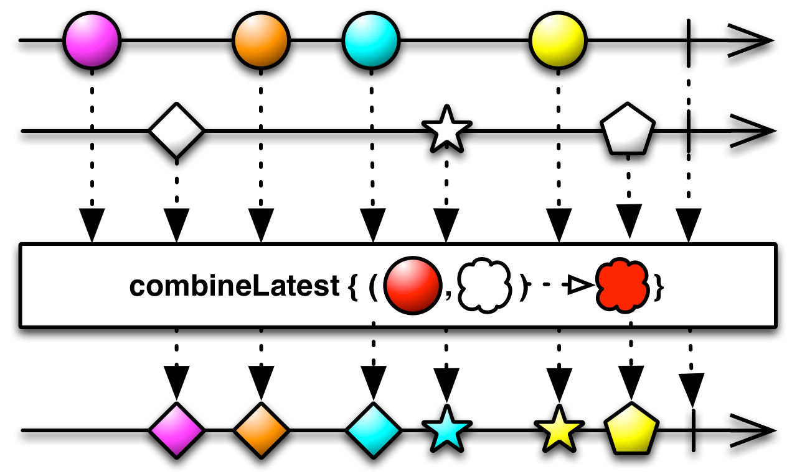

## CHAPTER 1 리액티브 프로그래밍 소개

#### 1.1 리액티브 프로그래밍

>명령형 프로그래밍(절차에 따라 순서대로 실행, pull 방식)과 다르게 데이터 흐름을 먼저 정의하고 데이터가 변경되었을 때 연관되는 함수나 수식이 업데이트 되는 방식, push 방식


멀티스레드 환경의 경우 같은 자원에 여러 스레드가 경쟁 조건에 빠지게 될 경우 계산 결과가 꼬이는 경우가 있는데 이를 해결할 수 있음

#### 1.2 RXJava를 만들게 된 이유

[1] 동시성을 적극적으로 끌어안을 필요가 있다.<br>
네트워크 통신을 효과적으로 줄이기 위해서는 서버측 동시성이 필요하다.<br>
RXJava는 클라이언트의 요청을 처리할 때 ```다수의 비동기 스레드를 생성하고 그 결과를 취합하여 최종 리턴```하는 방식으로 진행된다.
<br><br>
[2] 자바 Future를 조합하기 어렵다는 점을 해결해야 한다.
> Java Future: 실행 결과를 얻기까지 시간이 걸리는 메소드가 있다고 했을 때 실행 결과를 얻기까지 기다리는 대신 "교환권"을 받게 되는데 그 교환권을 Future라고 한다.<br>
Future를 받은 쓰레드는 나중에 Future를 사용해서 실행 결과를 받으러 간다.<br>
만약 실행 결과가 나와 있으면 바로 그것을 받고, 그렇지 않으면 준비가 될 때 까지 기다린다.

Java 8 에서 CompletableFuture 같은 클래스를 제공하지 않았기 때문에 ```비동기 흐름을 조합할 수 있는 방법```이 필요해서 제작했다.
<br><br>
[3] 콜백 방식의 문제점을 개선해야 한다.<br>
콜백(Callback; 시스템이 필요한 시점에 호출하는 이벤트)안에서 또 다른 콜백을 부르는 코딩 방식은 코드의 가독성을 떨어뜨리고 오류 발생시 디버깅이 어렵다는 단점이 있다. 이를 개선하기 위해 RXJava를 제작했다.
<br><br>

따라서 리액티브 프로그래밍은 Observable과 같은 데이터 소스와 map(), filter(), reduce()와 같은 리액티브 연산자를 제공한다.
<br><br>

#### 1.3 RXJava 처음 시작하기

Gradle 추가
```
dependencies {
    implementation 'io.reactivex.rxjava2:rxjava:2.1.9'
}
```
```java
public class Chapter1 {

    public void emit() {
        // Observable : 데이터의 변호가 발생하는 테이터 소스
        // just() : Observable 선언 방식
        // subscribe() : Observable을 구독, 위 함수를 호출해야 데이터가 변화됐을 때 이벤트를 수신할 수 있음
        // emit : RXJava에서는 Observable이 subscribe() 함수를 호출한 구독자에게 데이터를 발행하는것으로 표현
        Observable.just("Hello", "RXJava 2!!")
                .subscribe(System.out::println);
    }
    public static void main(String[] args) {
        Chapter1 demo = new Chapter1();
        demo.emit();
    }
}
```
<br><br>
#### 1.4 RXJava를 어떻게 공부할 것인가

1. Observable 클래스 이해(뜨거운 Observable, 차가운 Observable)
2. map(), filter(), reduce(), flatMap() 함수 사용법
3. 생성 연산자, 결합 연산자, 변환 연산자 등 카테고리별 주요 함수 이해
4. 스케줄러, subscribeOn(), observeOb()
5. 디버깅, 흐름 제어 함수
<br><br>

#### 1.5 마블 다이어그램 보는 법
<br>


This is timeline of the Observable. Time flows from left to right<br>
Observable의 시간 표시줄, 시간순으로 데이터가 발행되는 것을 표현
<br><br>
These are items emitted by the Observable.<br>
Observable이 발행하는 데이터, 데이터를 발행할 때는 onNext 알림이 발생
<br><br>
This vertical line indicates that the Observable has completed successfully.<br>
파이프는 Observable에서 데이터 발행을 완료헀다는 의미, 완료하면 onComplete 알림이 발생
<br><br>
These dotted lines and this box indicate that a transformation is being applied to the OBservble. The text inside ths box shows the nature of the transformation.<br>
점선 화살표는 입력과 출력을 의미, 가운데 박스는 함수를 의미, flip 함수는 입력값을 뒤집는 함수이므로 결과값의 모양이 위아래 180도 뒤집힘
<br><br>
This Observable is the result of the transformation. If for some reason the Observable termivates abnormally, with an error, the vertical line is replaced by an X.<br>
함수의 결과가 표시된 시간 표시줄이며 입력값을 처리할 때 에러가 발생하면 X로 표기
<br><br>



흰 마름모 입력됨<br>
보라색 원 Observable과 흰 마름모 Observable이 만나 보라색 마름모 Observable 생성<br>
주황색 원 Observable과 흰 마름모 Observable이 만나 주황색 마름모 Observable 생성<br>
파란색 원 Observable과 흰 마름모 Observable이 만나 파란색 마름모 Observable 생성<br>
흰 별 입력됨<br>
파란색 원 Observable과 흰 별 Observable이 만나 파란색 별 Observable 생성<br>
노란색 원 Observable과 흰 별 Observable이 만나 노란색 별 Observable 생성<br>
흰 오각형 입력됨<br>
노란색 원 Observable과 흰 오각형 Observable이 만나 노란색 오각형 Observable 생성<br>

<br><br>
참고:<br>
&nbsp;&nbsp;[Netflix 기술블로그]<br>
&nbsp;&nbsp;[마블 다이어그램: flip()]<br>

[Netflix 기술블로그]: https://medium.com/netflix-techblog/reactive-programming-in-the-netflix-api-with-rxjava-7811c3a1496a
[마블 다이어그램: flip()]: http://reactivex.io/RxJava/javadoc/io/reactivex/Observable.html