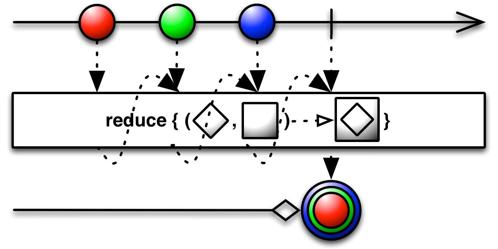

## CHAPTER 3 리액티브 연산자 입문


#### 3.1 map() 함수

입력값을 어떤 함수에 넣어서 원하는 값으로 변환하는 함수
```java
String[] balls = {"1", "2", "3", "5"};
Observable<String> source = Observable.fromArray(balls)
    .map(ball -> ball + "#");
source.subscribe(Log::i);
```

Function 인터페이스틑 적용한 map() 함수
```java
Function<String, String> getSharp = ball -> ball + "#";
String[] balls = {"1", "2", "3", "5"};
Observable<String> source = Observable.fromArray(balls)
    .map(getSharp);
source.subscribe(Log::i);
```

데이터 타입 추론
```java
// 원래 람다 표현식의 몸체는 중괄호({}) 안에 있어야 하지만,
// 문장이 1개라면 중괄호를 생략할 수 있음
Function<String, Integer> ballToIndex = ball -> {
    switch(ball) {
        case "RED":     return 1;
        case "YELLOW":  return 2;
        case "GREEN":   return 3;
        case "BLUE":    return 5;
        default:        return -1;
    }
};

String[] balls = {"1", "2", "3", "5"};
Observable<Integer> source = Observable.fromArray(balls)
    .map(ballToIndex); // 명시적인 타입 변환 없이 바로 사용 가능
source.subscribe(System.out::println);
```


#### 3.2 flatMap() 함수

map()을 좀 더 발전시킨 함수로서, map()은 원하는 입력값을 어떤 함수에 넣어서 변환할 수 있는 일대일 함수지만, flatMap()은 똑같이 함수에 넣으면 결과가 Observable로 출력됨<br>
map() : 일대일 함수<br>
flatMap() : 일대다 혹은 일대일 Observable <br>


```java
Function<String, Observable<String>> getDoubleSharps
     = ball -> Observable.just(ball + "#", ball + "#");

String[] balls = {"1", "3", "5"};
Observable<String> source = Observable.fromArray(balls)
    .flatMap(getDoubleSharps);
source.subscribe(Log::i);
```

#### 3.2.1 구구단 만들기

```java
Scanner in = new Scanner(System.in);
System.out.println("Gugudan Input:");
int dan = Integer.parseInt(in.nextLine());

// 1. for문을 Observable로 변환
// Observable<Integer> source = Observable.range(1, 9);
// source.subscribe(row -> System.out.println(dan + " * " + row  + " = " + dan * row));

// 2. flatMap()을 활용하여 변환
// 2-1. 필요한 함수 정의
// Function<Integer, Observable<String>> gugudan
//     = num -> Observable.range(1, 9).map(row -> num + " * " + row  + " = " + dan * row);
    // 입력 변수를 dan으로 하면 위에 선언된 dan과 혼동이 되기 때문에 num을 사용
// 2-2. 값 1개를 전달받아서 여러개를 출력하기 때문에 flatMap() 사용
// Observable<String> source = Observable.just(dan).flatMap(gugudan);
// source.subscribe(System.out::println);    

// 3. resultSelector 사용
Observable<String> source = Observable.just(dan)
    .flatMap(gugu -> Observable.range(1, 9), 
    (gugu, i) -> gugu + " * " + i + " = " + gugu*i);
source.subscribe(System.out::println);

in.close();
```


#### 3.3 filter() 함수

원하는 데이터만 걸러내는 함수

```java
// 기본예제
String[] objs = {"1 CIRCLE", "2 DIAMOND", "3 TRIANGLE", "4 DIAMOND", "5 CIRCLE", "6 HEXAGON"};
Observable<String> source = Observable.fromArray(objs)
    .filter(obj -> obj.endsWith("CIRCLE"));
source.subscribe(System.out::println);
```

```java
// 짝수 필터링 예제
Integer[] data = {100, 34, 27, 99, 50};
Observable<Integer> source = Observable.fromArray(objs)
    .filter(number -> number % 2 == 0);
source.subscribe(System.out::println);
```

비슷한 함수들<br>
first(default) 함수 : Observable의 첫 번째 값을 필터, 만약 값 없이 완료되면 기본값을 대신 리턴<br>
last(default) 함수 : Observable의 마지막 값을 필터, 만약 값 없이 완료되면 기본값을 대신 리턴<br>
take(N) 함수 : 최초 N개만 필터<br>
takeLast(N) 함수 : 마지막 N개만 필터<br>
skip(N) 함수 : 최초 N개 값을 건너뜀<br>
skipLast(N) 함수 : 마지막 N개 값을 건너뜀<br>

```java
Integer[] numbers = {100, 200, 300, 400, 500};
Single<Integer> single;
Observable<Integer> source;

// 1. first
single = Observable.fromArray(numbers).first(-1);
single.subscribe(data -> System.out.println("first() value = " + data));

// 2. last
single = Observable.fromArray(numbers).last(999);
single.subscribe(data -> System.out.println("last() value = " + data));

// 3. take(N)
single = Observable.fromArray(numbers).take(3);
single.subscribe(data -> System.out.println("take(3) value = " + data));

// 4. takeLast(N)
single = Observable.fromArray(numbers).takeLast(3);
single.subscribe(data -> System.out.println("takeLast(3) value = " + data));

// 5. skip(N)
single = Observable.fromArray(numbers).skip(2);
single.subscribe(data -> System.out.println("skip(2) value = " + data));

// 6. skipLast(N)
single = Observable.fromArray(numbers).skipLast(2);
single.subscribe(data -> System.out.println("skipLast(2) value = " + data));

// 결과값
/*
first() value = 100
last() value = 500
take(3) value = 100
take(3) value = 200
take(3) value = 300
takeLast(3) value = 300
takeLast(3) value = 400
takeLast(3) value = 500
skip(2) value = 300
skip(2) value = 400
skip(2) value = 500
skipLast(2) value = 100
skipLast(2) value = 200
skipLast(2) value = 300
*/
```


#### 3.4 reduce() 함수

발행한 데이터를 모두 사용하여 어떤 최종 결과 데이터를 합성할 때 활용(발행한 데이터를 취합하여 어떤 결과를 만들어 낼 때 사용)



```java
String[] balls = {"1", "3", "5"};
Maybe<String> source = Observable.fromArray(balls)
    .reduce((ball1, ball2) -> ball2 + "(" + ball1 + ")");
source.subscribe(System.out::println);
// 결과 : 5(3(1))
```

#### 3.4.1 데이터 쿼리하기

```java
// TV 매출의 총합을 계산

// 1. 데이터 입력
// Pair : 아파치 커먼즈의 Lang 3 라이브러리에서 제공하는 Pair<'T, U'> 객체 활용
// implementation 'org.apache.commons:commons-lang3:3.1'
List<Pair<String, Integer>> sales = new ArrayList<>();

sales.add(Pair.of("TV", 2500));
sales.add(Pair.of("Camera", 300));
sales.add(Pair.of("TV", 1600));
sales.add(Pair.of("Phone", 800));

Maybe<Integer> tvSales = Observable.fromIterable(sales)
    // 2.매출 데이터 중 TV 매출 필터링
    .filter(sale -> "TV".equals(sale.getLeft()))
    .map(sale -> sale.getRight())
    // 3. TV 매출의 합 구함
    .reduce((sale1, sale2) -> sale1 + sale2);

tvSales.subscribe(tot -> System.out.println("TV Sales : $" + tot));
```


<br><br>
참고:<br>
&nbsp;&nbsp;[마블 다이어그램: flatMap()]<br>

[마블 다이어그램: flatMap()]: http://reactivex.io/documentation/operators/flatmap.html