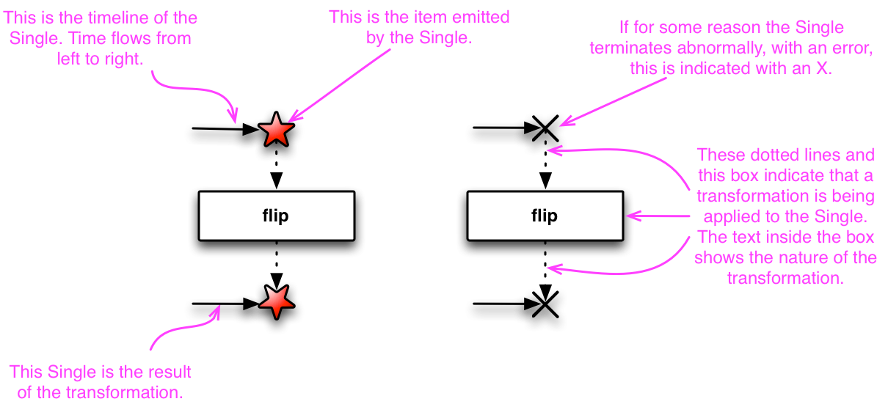

## CHAPTER 2 Observable 처음 만들기

#### 2.1 Observable 클래스

Observable의 세 가지 알림<br>
onNext: Observable이 데이터 발행을 알림<br>
onComplete: 모든 데이터의 발행을 완료했음을 알림(단 한번만 발생)<br>
onError: Observable에서 어떤 이유로 에러가 발생함을 알림(onError가 발생하면 Observable의 실행을 즉시 종료)<br>
<br>
2.1.1 just() 함수<br>
인자로 넣은 데이터를 차례로 발행함(인자로 여러 개, 최대 10개의 값을 넣을 수 있음. 단 타입은 모두 같아야 함)<br>
```java
public void emit() {
    Observable.just(1, 2, 3, 4, 5)
        .subscribe(System.out::println);
}
```

2.1.2 subscribe() 함수와 Disposable 객체<br>
subscribe(): 원하는 행동을 사전에 정의해둔 후 실제 그것이 실행되는 시점을 조절할 때 사용<br>
dispost(): Observable에게 더 이상 데이터를 발행하지 않도록 구독을 해지하는 함수<br>
<br>
2.1.3 create() 함수<br>
just() 함수는 데이터를 인자로 넣으면 자동으로 알림 이벤트(onNext, onComplete, onError)가 발생하지만 create() 함수는 알림을 개발자가 직접 호출해야 함.<br>

```java
public void emit() {
    Observable<Integer> source = Observable.create(
        (ObservableEmitter<Integer> emitter) -> {
            emitter.onNext(100);
            emitter.onNext(200);
            emitter.onNext(300);
            emitter.onComplete();
        }
    );
    source.subscribe(System.out::println); // 이와 같은 형태를 메서드 레퍼런스라고 함
    source.subscribe(new Consumer<Integer>() { // 메서드 레퍼런스의 원형은 다음과 같음
        @Override
        public void accept(Integer data) throws Exception {
            System.out.println(data);
        }
    });
    source.subscribe(data -> System.out.println(data)); // 이렇게 표기할 수도 있음    
}
```
create() 사용시 주의사항<br>
1) Observable이 구독 해지(dispose)되었을 때 등록된 콜백을 모두 해제해야 함. 그렇지 않으면 메모리 누수(memory leak)가 발생<br>
2) 구독자가 구독하는 동안에만 onNext와 onComplete 이벤트를 호출해야 함. 반드시 subscribe 해줘야 함<br>
3) 에러가 발생했을 때는 오직 onError 이벤트로만 에러를 전달해야 함<br>
4) 배압(back pressure)을 직접 처리해야 함<br>
<br>
2.1.4 fromArray() 함수<br>
배열에 들어 있는 데이터를 처리할 때 fromArray() 함수를 활용<br>

```java
public void emit() {
    Integer[] arr = {100, 200, 300};
    Observable<Integer> source = Observable.fromArray(arr);
    source.subscribe(System.out::println);
}
```

```java
// int[]을 사용하려면 Integer[]로 형변환 해줘야 함
public void emit() {
    int[] intArray = {100, 200, 300};
    Observable<Integer> source = Observable.fromArray(toIntegerArray(intArray));
    source.subscribe(System.out::println);
}

public static Integer[] toIntegerArray(int[] intArray) {
    return IntStream.of(intArray).boxed().toArray(Integer[]::new);
}
```

2.1.5 fromIterable() 함수<br>
Iterable<E> 인터페이스를 구현하는 대표적인 클래스는<br>
ArrayList(List 인터페이스), Array BlockingQueue(BlockingQueue 인터페이스), HashSet(Set 인터페이스), LinkedList, Stack, TreeSet, Vector 등이 있음.
```java
// List에서 사용
public void emit() {
    List<String> names = new ArrayList<>();
    names.add("Jerry");
    names.add("William");
    names.add("Bob");

    Observable<String> source = Observable.fromIterable(names);
    source.subscribe(System.out::println);
}
```

2.1.6 fromCallable() 함수<br>
```java
public void emit() {
    Callable<String> callable = () -> {
        Thread.sleep(1000);
        return "Hello Callable";
    };

    Observable<String> source = Observable.fromCallable(callable);
    source.subscribe(System.out::println);
}
```

2.1.7 fromFuture() 함수<br>
```java
Future<String> future = Executors.newSingleThreadExecutor().submit(() -> {
    Thread.sleep(1000);
    return "Hello Future";
});

Observable<String> source = Observable.fromFuture(future);
source.subscribe(System.out::println);
```

2.1.8 fromPublisher() 함수<br>
```java
Publisher<String> publisher = (Subscriber<? super String> s) -> {
    s.onNext("Hello Observable.fromPublisher()");
    s.onComplete();
};

Observable<String> source = Observable.fromPublisher(publisher);
source.subscribe(System.out::println);
```
<br>

#### 2.2 Single 클래스

Observable 클래스는 데이터를 무한하게 발행할 수 있지만 Single 클래스는 오직 1개의 데이터만 발행하도록 한정함<br>
보통 결과가 유일한 서버 API를 호출할 때 유용하게 사용할 수 있음<br><br>



Single 클래스는 데이터 하나가 발행과 동시에 종료(onSuccess; onNext와 onComplete 함수의 통합)됨<br>
따라서 Single 클래스의 라이프 사이클 함수는 onSuccess와 onError함수로 구성됨<br>
<br>

2.2.1 just() 함수<br>
```java
Single<String> source = Single.just("Hello Single");
source.subscribe(System.out::println);
```

2.2.2 Observable에서 Single 클래스 사용<br>
```java
public class Chapter2 {

    public static void main(String[] args) {

        // 1. 기존 Observable에서 Single 객체로 변환
        Observable<String> source = Observable.just("Hello Single");
        Single.fromObservable(source)
                .subscribe(System.out::println);
        // 출력 : Hello Single

        // 2. single() 함수를 호출해 Single 객체 생성
        Observable.just("Hello Single")
                .single("default item")
                .subscribe(System.out::println);
        // 출력 : Hello Single

        // 3. first() 함수를 호출해 Single 객체 생성
        String[] colors = {"Red", "Blue", "Gold"};
        Observable.fromArray(colors)
                .first("default value")
                .subscribe(System.out::println);
        // 출력 : Red
        // 배열 중 Red라는 데이터를 발행한 후 onSuccess 이벤트가 발생하여 Red만 출력됨

        // 4. empty Observable에서 Single 객체 생성
        Observable.empty()
                .single("default value")
                .subscribe(System.out::println);
        // 출력 : default value

        // 5. take() 함수에서 Single 객체 생성
        Observable.just(new Order("ORD-1"), new Order("ORD-2"))
                .take(1)
                .single(new Order("default value"))
                .subscribe(System.out::println);
        // 출력 : Order ID: ORD-1
    }

    public static class Order {
        String mId;

        public Order(String mId) {
            this.mId = mId;
        }

        @Override
        public String toString() {
            return "Order ID: " + mId;
        }
    }
}
```

2.2.3 Single 클래스의 올바른 사용 방법<br>
```java
Observable.just("Hello Single", "Error")
    .single("default item")
    .subscribe(System.out::println);
// 다음과 같은 에러 발생
// io.reactivex.exceptions.OnErrorNotImplementedException: Sequence contains more than one element!
// java.lang.IllegalArgumentException: Sequence contains more than one element!
```

<br>

#### 2.3 Maybe 클래스

최대 데이터 하나를 가질 수 있지만 데이터 발행 없이 바로 데이터 발생을 완료할수도 있음(Single 클래스는 1개 완료, Maybe 클래스는 0 혹은 1개 완료)<br>
즉, Maybe 클래스는 Single 클래스에 onComplete 이벤트가 추가된 형태<br>
elementAt(), firstElement(), flatMapMaybe(), lastElement(), reduce(), singleElement() 함수 등을 사용할 수 있음
<br>

#### 2.4 뜨거운 Obserbable

차가운 Observable은 Observable을 선언하고 just(), fromIterable() 함수를 호출해도 옵서버가 subscribe() 함수를 호출하여 구독하지 않으면 데이터를 발행하지 않음<br>
반면 뜨거운 Observable은 구독자의 존재 여부와 관계 없이 데이터를 발행하는 Observable. 단, 구독자로서 Observable에서 발행하는 데이터를 처음부터 모두 수신할 것으로 보장할 수 없음<br>
즉 차가운 Observable은 구독자가 구독하면 준비된 데이터를 처음부터 발행하지만 뜨거운 Observable은 구독한 시점부터 Observable에서 발행한 값을 얻음<br>
<br>
예시)<br>
차가운 Observable: 웹 요청, 데이터베이스 쿼리, 파일 읽기, 내가 원하는 URL이나 데이터를 지정하면 그때부터 서버나 데이터베이스 서버에 요청을 보내고 결과를 받아옴<br>
뜨거운 Observable: 마우스 이벤트, 키보드 이벤트, 시스템 이벤트, 센서 데이터, 주식 가격 등
<br>
뜨거운 Observable은 배압(Hack Pressure)을 주의해야 함<br>
Observable에서 데이터를 발행하는 속도와 구독자가 처리하는 속도의 차이가 클 때 발생


#### 2.5 Subject 클래스

Subject 클래스: 차가운 Observable을 뜨거운 Observable로 바꿔줌, Observable의 속성과 구독자의 속성을 모두 포함하고 있는 클래스, Observable처럼 데이터를 발행할 수도 있고 구독자처럼 발행된 데이터를 바로 처리할 수도 있음<br>
<br>
2.5.1 AsyncSubject 클래스<br>
Observable에서 발행한 마지막 데이터를 얻어올 수 있는 Subject 클래스<br>


1) 처음 구독자가 subscribe() 함수 호출<br>
2) 이후에 '1' 원, '2' 원이 발행된 후 두 번째 구독자가 subscribe() 함수 호출<br>
3) 마지막으로 '3' 원이 발행되고 데이터 발행을 완료(oonComplete)함<br>
완료되기 전까지는 구독자에게 데이터를 전달하지 않다가 완료됨과 동시에 첫 번째와 두 번째 구독자에게 마지막 데이터를 발행하고 종료<br>

```java
// Observable로 동작
AsyncSubject<String> subject = AsyncSubject.create();
subject.subscribe(data -> System.out.println("Subscriber #1 => " + data));
subject.onNext("1");
subject.onNext("3");
subject.subscribe(data -> System.out.println("Subscriber #2 => " + data));
subject.onNext("5");
subject.onComplete();
// 출력 : 
// Subscriber #1 => 5
// Subscriber #2 => 5
```

```java
// 구독자로 동작
Float[] temperature = {10.1f, 13.4f, 12.5f};
Observable<Float> source = Observable.fromArray(temperature);
AsyncSubject<Float> subject = AsyncSubject.create();
subject.subscribe(data -> System.out.println("Subscriber #1 => " + data));

source.subscribe(subject);
// 출력 : 
// Subscriber #1 => 12.5
```

```java
// onComplete() 함수 호출 후 구독
AsyncSubject<Integer> subject = AsyncSubject.create();
subject.onNext(10);
subject.onNext(11);
subject.subscribe(data -> System.out.println("Subscriber #1 => " + data));
subject.onNext(12);
subject.onComplete();
subject.onNext(13);
subject.subscribe(data -> System.out.println("Subscriber #2 => " + data));
subject.subscribe(data -> System.out.println("Subscriber #3 => " + data));
// 출력 : 
// Subscriber #1 => 12
// Subscriber #2 => 12
// Subscriber #3 => 12
// onComplete 이후에 발생하는 onNext()는 무지하고, onComplete 이후에 subscribe한 구독자는 onComplete 직전의 데이터를 갖는다
```

2.5.2 BehaviorSubject 클래스<br>
구독자가 구독을 하면 가장 최근 값 혹은 기본값을 넘겨주는 클래스<br>
```java
BehaviorSubject<String> subject = BehaviorSubject.createDefault("6");
subject.subscribe(data -> System.out.println("Subscriber #1 => " + data));
subject.onNext("1");
subject.onNext("3");
subject.subscribe(data -> System.out.println("Subscriber #2 => " + data));
subject.onNext("5");
subject.onComplete();
// 출력 : 
// Subscriber #1 => 6
// Subscriber #1 => 1
// Subscriber #1 => 3
// Subscriber #2 => 3
// Subscriber #1 => 5
// Subscriber #2 => 5
```

2.5.3 PublishSubject 클래스<br>
subscribe() 함수를 호출하면 해당 시간에 발생한 데이터를 그대로 구독자에게 전달받음

```java
PublishSubject<String> subject = PublishSubject.create();
subject.subscribe(data -> System.out.println("Subscriber #1 => " + data));
subject.onNext("1");
subject.onNext("3");
subject.subscribe(data -> System.out.println("Subscriber #2 => " + data));
subject.onNext("5");
subject.onComplete();
//출력:
// Subscriber #1 => 1
// Subscriber #1 => 3
// Subscriber #1 => 5
// Subscriber #2 => 5
```

2.5.4 ReplaySubject 클래스<br>

Subject 클래스의 목적은 뜨거운 Observable을 활용하는 것인데 ReplaySubject 클래스는 차가운 Observable처럼 동작하기 때문에 가장 특이하고 사용할 때 주의해야 함<br>
ReplaySubject 클래스는 구독자가 새로 생기면 항상 데이터의 처음부터 끝까지 발행하는 것을 보장해줌<br>
그러므로 모든 데이터 내용을 저장해두는 과정 중 메모리 누수가 발생할 가능성을 염두에 두고 사용할 때 주의해야 함<br>
```java
ReplaySubject<String> subject = ReplaySubject.create();
subject.subscribe(data -> System.out.println("Subscriber #1 => " + data));
subject.onNext("1");
subject.onNext("3");
subject.subscribe(data -> System.out.println("Subscriber #2 => " + data));
subject.onNext("5");
subject.onComplete();
//출력:
// Subscriber #1 => 1
// Subscriber #1 => 3
// Subscriber #2 => 1
// Subscriber #2 => 3
// Subscriber #1 => 5
// Subscriber #2 => 5
```

<br>

#### 2.6 ConnectableObservable 클래스

Subject 클래스 처럼 차가운 Observable을 뜨거운 Observable로 변환해줌<br>
보통 Observable에 subscribe()를 호출하면 데이터 발행을 시작하는데 ConnectableObservable은 connect()를 사용한 시점부터 subscribe() 함수를 호출한 모든 구독자에게 데이터를 발행<br>
connect() 함수를 호출한 이후에 구독한 구독자에게는 구독 이후에 발생한 데이터부터 발행

```java
String[] dt = {"1", "3", "5"};
Observable<String> balls = Observable.interval(100L, TimeUnit.MILLISECONDS)
    .map(Long::intValue)
    .map(i -> dt[i])
    .take(dt.length);
ConnectableObservable<String> source = balls.publish();
source.subscribe(data -> System.out.println("Subscriber #1 => " + data));
source.subscribe(data -> System.out.println("Subscriber #2 => " + data));
source.connect();

try {
    Thread.sleep(250);
} catch (InterruptedException e) {
    e.printStackTrace();
}
source.subscribe(data -> System.out.println("Subscriber #3 => " + data));
try {
    Thread.sleep(100);
} catch (InterruptedException e) {
    e.printStackTrace();
}
// 출력: 
// Subscriber #1 => 1
// Subscriber #2 => 1
// Subscriber #1 => 3
// Subscriber #2 => 3
// Subscriber #1 => 5
// Subscriber #2 => 5
// Subscriber #3 => 5
```

<br><br>
참고:<br>
&nbsp;&nbsp;[마블 다이어그램: Single 클래스]<br>

[마블 다이어그램: Single 클래스]: http://reactivex.io/documentation/ko/single.html